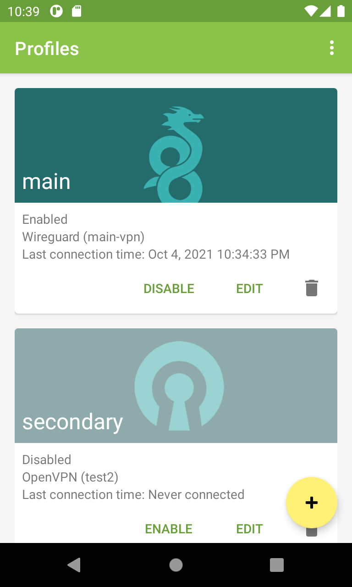

# VPN Manager - Android

VPN management/automation application for Android

## Features

- Ability to automate activation of VPN
- Supports Wireguard and OpenVPN
- Conditional activation depending on WiFi/mobile network state
  - WiFi SSID/mobile carrier name inclusion and exclusion lists

## Screenshots

<table>
<tr>
<td></td>
<td></td>
<td></td>
</tr>
</table>